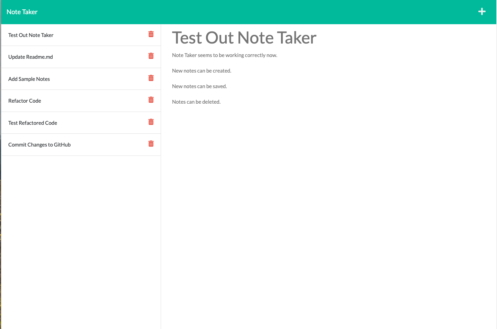

# Note-Taker
## Description

This new cloud application is to facilitate taking notes with a title and text.   The data is stored in a server side file.

## Table of Contents

- [Installation](#installation)
- [Usage](#usage)
- [Credits](#credits)
- [License](#license)

## Installation

As this application runs completely in the cloud, there is no installation required to run the appliation from the cloud.  If you wish to download the application from GitHub and run it locally, clone the entire repository to a local folder and install it by typing "npm install".  This assumes npm is installed on your system.  That should install Express and Short-Unique-Id.  The GitHub repository may be found here: https://github.com/melliott7264/note-taker.

## Usage

This application can be run from this URL:  https://calm-harbor-57404.herokuapp.com/ on Heroku.  This is a very simple application in that you can only create, save and delete notes.  You click the plus icon a the upper right to create a new note.   That clears the Note Title and Note Text fields so that you can enter fresh text in them.   Once entered, click on the disk icon that will appear at the upper right to save the note.   The saved note should then appear in the list of notes to the left.  If you want to delete a note, click on the trash can icon next to it.   

## Credits

Mark Elliott  https://github.com/melliott7264

This application was built as part of Challenge 11 for the University of Richmond Coding Boot Camp.  Some starter code was provided including all the front end files.  The frontend index.js file had to be updated so that the GET, POST, and Delete code worked with the backend server.js file.

Using NPM package Short Unique ID(https://www.npmjs.com/package/short-unique-id) to generate a unique note ids.

## License

Copyright (c) 2022 Mark Elliott

Permission is hereby granted, free of charge, to any person obtaining a copy
of this software and associated documentation files (the "Software"), to deal
in the Software without restriction, including without limitation the rights
to use, copy, modify, merge, publish, distribute, sublicense, and/or sell
copies of the Software, and to permit persons to whom the Software is
furnished to do so, subject to the following conditions:

The above copyright notice and this permission notice shall be included in all
copies or substantial portions of the Software.

THE SOFTWARE IS PROVIDED "AS IS", WITHOUT WARRANTY OF ANY KIND, EXPRESS OR
IMPLIED, INCLUDING BUT NOT LIMITED TO THE WARRANTIES OF MERCHANTABILITY,
FITNESS FOR A PARTICULAR PURPOSE AND NONINFRINGEMENT. IN NO EVENT SHALL THE
AUTHORS OR COPYRIGHT HOLDERS BE LIABLE FOR ANY CLAIM, DAMAGES OR OTHER
LIABILITY, WHETHER IN AN ACTION OF CONTRACT, TORT OR OTHERWISE, ARISING FROM,
OUT OF OR IN CONNECTION WITH THE SOFTWARE OR THE USE OR OTHER DEALINGS IN THE
SOFTWARE.

---
